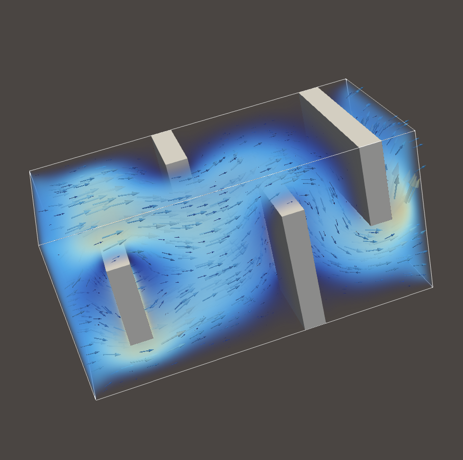
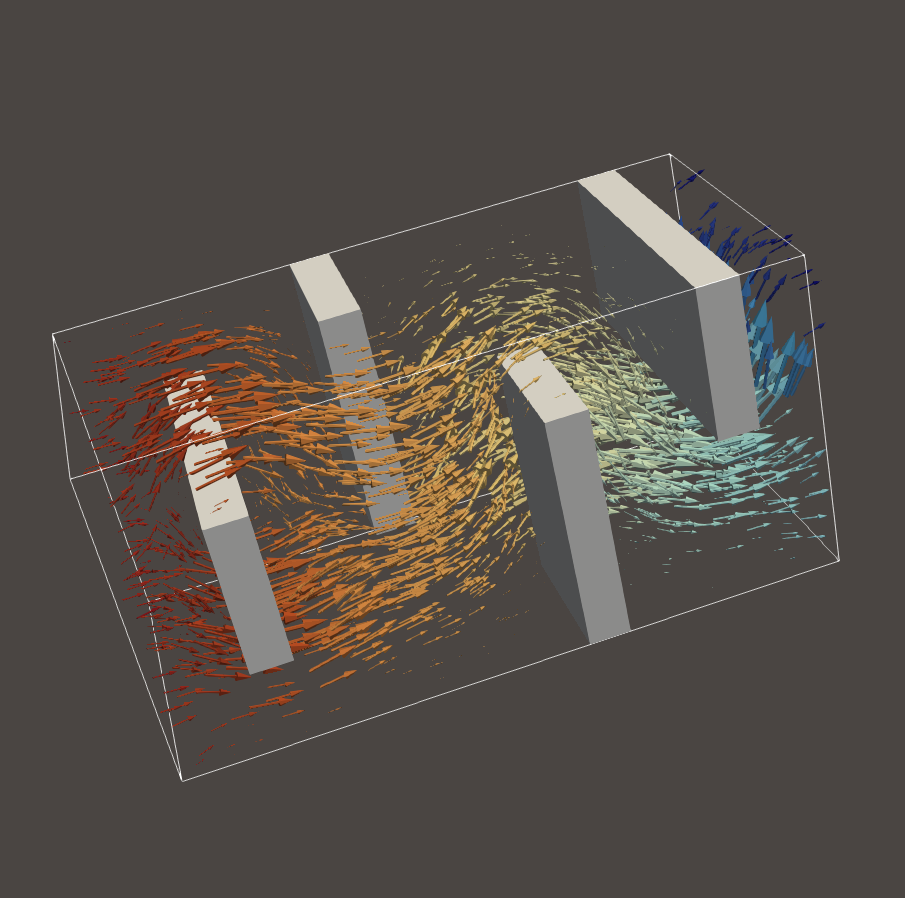

# Stokes-Brinkman finite-difference fluid solver

## Gallery

|  |   |
|:--------:|:-------:|
| Velocity field magnitude | Pressure colored velocity field |

## TODO

- [x] complete fused Dxx rhs computation
- [x] add support for floats in fused Dxx rhs computation
- [x] fuse pressure update into Dzz solve
- [ ] complete fused pressure solve
- [x] test with obstacles using low permeability
- [ ] convergence test with variable permeability
- [x] parallelize kernels across cores (pthreads)
- [ ] implement schur complement
- [ ] parallelize schur complement across nodes (MPI)
- [ ] outflow boundary conditions
- [ ] benchmark AUTO_VEC performance
- [ ] benchmark with huge TLB pages
