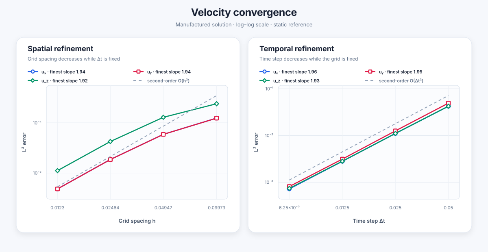
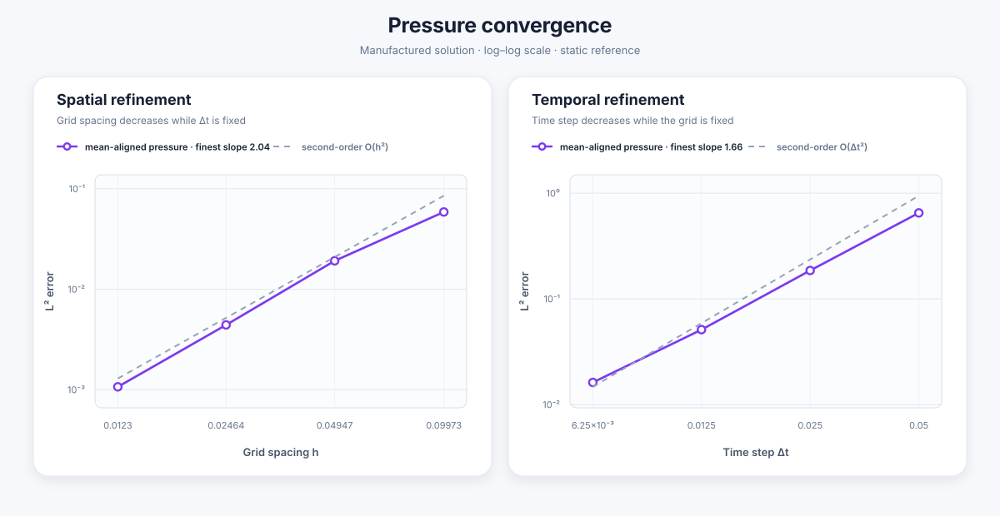
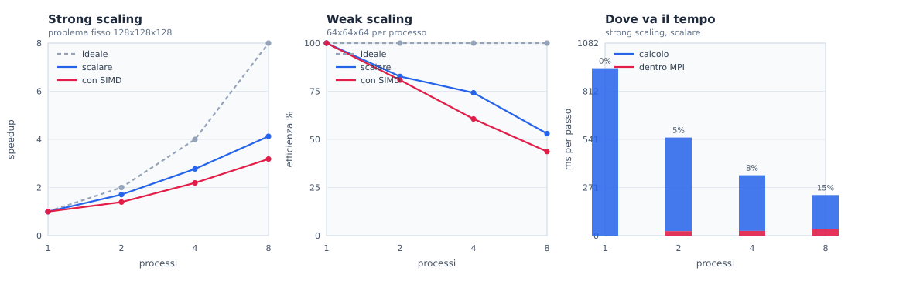

# Navier Stokes Brinkman Equation Solver


## Build

Compile the main `solver` executable:

```sh
make solver
```

Enable the explicit SIMD momentum kernels with independently tunable blocks of SIMD vectors:

```sh
make SIMD=1 ZETA_SIMD_VECTORS=4 U_SIMD_VECTORS=8
```

Compile all tests:

```sh
make tests
```

The test executables are created in `build/tests/` and can be run separately:

```sh
./build/tests/paper_man
./build/tests/moving_sphere
./build/tests/channel_obstacle
```

## Convergence study

Run the spatial and temporal convergence tests:

```sh
./scripts/run_convergence.sh
```

Errors and convergence rates are written to `build/convergence/results.csv`.





Generate and replace the static plots with, reading from `build/convergence/results.csv`:

```sh
./scripts/plot_convergence.py
```

## Parallel run

Build against MPI and run with several processes:

```sh
make MPI=1
mpirun -n 8 ./solver
```

The grid is split into blocks, one per process; `MPI_Dims_create` chooses the
shape unless the tests are given one on the command line.  The tridiagonal
solves that cross a block boundary are completed by the backend `TRIDIAG`
selects, a Schur complement by default, so the answer does not depend on how
many processes are used: `paper_man` prints the same error norms, digit for
digit, from one process up to eight.

## Threads

Build with OpenMP to spread the lines of each block over the cores of one
machine:

```sh
make OMP=1 SIMD=1
OMP_NUM_THREADS=4 ./solver
```

A thread takes whole lines, never part of one, so every sum keeps the order it
had before: the answer is the same digit for digit as with a single thread, the
same way it is across processes, and `paper_man` checks both.

Threads compose with MPI.  `--bind-to none` is needed because `mpirun`
otherwise pins each process to one core, which its threads then share:

```sh
make MPI=1 OMP=1 SIMD=1
OMP_NUM_THREADS=4 mpirun --bind-to none -n 2 ./solver
```

The two are not interchangeable.  A process takes a block, and a direction that
gets split loses the vectorized kernels and turns one local Thomas solve into
three; a thread takes lines, which stay independent however the domain is cut.
The `hybrid` study of the scaling script measures where the balance falls.

## Tridiagonal backend

`TRIDIAG` picks *how* a grid line that has been split across processes is
solved.  It is a different question from `MPI`, `OMP` and `SIMD`, which decide
whether the line is split at all, whether threads help inside a block, and how
wide the kernels are.  The four compose.

```sh
make TRIDIAG=schur MPI=1 OMP=1 SIMD=1     # the default
```

| value | method | cost |
|---|---|---|
| `schur` | Schur complement | three local Thomas solves per line; one exchange and one collective per group of lines |
| `pipeline` | pipelined Thomas | one local solve per line; the wait is hidden by sending many independent lines through the processes in batches |

Schur pays in arithmetic, the pipeline pays in latency.  The pipeline wins when
there are many more lines than processes, which is the normal case.

The choice is a directory — `src/tridiag/$(TRIDIAG)/` — not a chain of
`#ifdef`, so exactly one backend is ever compiled and the two cannot silently
drift into each other.  The physics they share lives in
`include/momentum_row.h`: one copy of the formulas, two memory layouts.

`TRIDIAG=pipeline` does not build yet.  The sources under
`src/tridiag/pipeline/` are the ones merged from the `pipeline` branch and
still speak `Domain` and the compile-time `WIDTH`/`HEIGHT` macros instead of
`Decomp` and the runtime `sim` parameters; the Makefile stops with a message
saying so rather than with a page of compiler errors.

## Scaling study

Measure how much the parallel run gains:

```sh
./scripts/run_scaling.sh          # strong, weak and hybrid, results in build/scaling/
SIMD=0 RESULTS_SUFFIX=_scalar ./scripts/run_scaling.sh
HYBRID=0 ./scripts/run_scaling.sh # skip the hybrid study
./scripts/plot_scaling.py         # figure in docs/scaling/
```

The second run disables the vectorized kernels.  They only apply to directions
that are not split, so comparing with them enabled measures two things at once.



## Solver structure

`solver_init` allocates the numerical fields and initializes them through the
functions stored in `Data`. Then, `solver_solve` advances the solution for
`STEPS` time steps:

```text
solver_init
    |
    v
time-step loop
    |
    +-- momentum_step
    |      +-- eta: solve along X
    |      +-- zeta: solve along Y
    |      +-- u: solve along Z
    |
    +-- pressure_step
           +-- psi
           +-- phi_low
           +-- phi_high
           +-- pressure update
```

The momentum systems are solved one direction at a time with the Thomas
algorithm for tridiagonal matrices. The pressure correction is similarly
factorized into three directional solves. `momentum.c` and `pressure.c`
implement these two stages, while `physics.c`, `field.c`, and `data.c` provide
the physical terms, field utilities, and problem definition.

## Types

`Real` is the scalar type used by every numerical field. It is `double` by
default and becomes `float` when the code is compiled with `-DUSE_FLOAT`.

```text
ScalarField                         VectorField
+------------------+                +------------------+
| Real *v          |                | Real *v_x        | --> [x0][x1]...[xN]
+------------------+                | Real *v_y        | --> [y0][y1]...[yN]
                                    | Real *v_z        | --> [z0][z1]...[zN]
                                    +------------------+
```

The main structures are:

```text
Data
+-- name                      scenario name used for output
+-- bc_velocity()             boundary velocity
+-- forcing_fn()              forcing term
+-- porosity_fn()             porosity field
+-- porosity_time_dependent   boolean
+-- velocity_fn()             initial/exact velocity
+-- pressure_fn()             initial/exact pressure

SolverMemState
+-- eta, zeta, u, k           VectorField
+-- pressure, pressure_star   ScalarField

SolverStats
+-- execution times for the solver stages, stored in nanoseconds
```

Function pointers in `Data` keep the numerical solver independent from a
specific physical test case. `SolverMemState` groups all
fields that must remain available between time steps.

## Memory management

```text
solver_init
    +-- allocate persistent fields
        +-- 4 VectorField = 12 full-grid arrays
        +-- 2 ScalarField =  2 full-grid arrays

solver_solve
    +-- allocate pressure_buffer   1 full-grid temporary array
    +-- allocate rhs and tmp       2 reusable line/block buffers per thread
    +-- run all time steps
    +-- free pressure_buffer, rhs, and tmp
```
